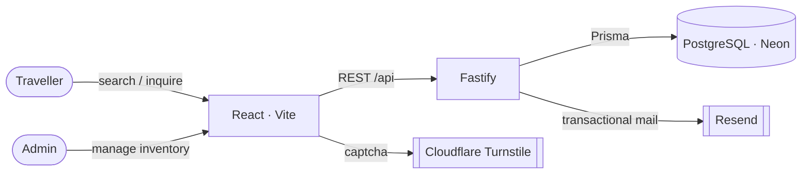

<!-- ══════════════════════════════════════════════════════════════════════════ -->
<!--                              H U M S A F A R                               -->
<!-- ══════════════════════════════════════════════════════════════════════════ -->

<div align="center">

<a name="top"></a>

<!-- Animated header wave -->


<!-- Typing tagline -->
<a href="#top">
  
</a>

<br/>

<!-- Badges -->
<p>
  
  
  
  
  
  
</p>

<p>
  
  
  
  
</p>

<sub><b>A warm, premium, motion-rich platform to compare and book trains &amp; intercity buses — backed by a hardened Fastify API and a live admin-managed inventory.</b></sub>

</div>

<br/>

<!-- ─────────────────────────────────────────────────────────────────────────── -->

## ✨ Overview

**HumSafar** ("fellow traveller") is a two-part application:

- 🎨 **Frontend** — a Vite + React 19 single-page experience with a cinematic
  preloader, GSAP-driven motion, a 3D hero scene, and a calm, editorial design
  system built on warm neutrals and a coral → gold gradient.
- 🛡️ **API** — a security-hardened Fastify + Prisma service backed by
  PostgreSQL (Neon), serving live train &amp; bus inventory, booking inquiries,
  status tracking, and an obscured admin dashboard.

<div align="center">
<table>
<tr>
<td align="center" width="25%">🚆<br/><b>Live inventory</b><br/><sub>Trains &amp; buses from DB</sub></td>
<td align="center" width="25%">🔎<br/><b>Smart search</b><br/><sub>Both directions, sorted by fare</sub></td>
<td align="center" width="25%">📝<br/><b>Guided booking</b><br/><sub>Human-assisted inquiries</sub></td>
<td align="center" width="25%">🔐<br/><b>Hardened admin</b><br/><sub>JWT + obscure path</sub></td>
</tr>
</table>
</div>

<br/>

## 🎬 Experience Highlights

| Moment | What happens |
| --- | --- |
| **Preloader** | A 3D-tilted route line draws itself, station nodes light up, a train head glides along, and *"HumSafar"* is written in calligraphy by a moving pen nib. |
| **Hero** | A living scene with layered depth, magnetic cursor, and a warm ambient glow. |
| **Search** | Query live routes; results merge trains + buses, both directions, parsed by duration and fare. |
| **Inquiry** | A multi-step flow with captcha (Cloudflare Turnstile) that turns interest into a delivered booking request. |
| **Track** | Look up an inquiry and follow its status history. |
| **Admin** | Manage train &amp; bus records, review inquiries — all behind an obscured, JWT-protected path. |

<br/>

## 🧱 Tech Stack

<div align="center">

**Frontend**


**Backend &amp; Infra**


</div>

- **Motion**: GSAP timelines, magnetic interactions, `prefers-reduced-motion` aware.
- **State/data**: TanStack Query for server state on the client.
- **Design tokens**: a single locked source of truth (`src/styles/tokens.js`) feeding Tailwind, inline styles, and shaders.
- **Security**: Helmet, CORS allow-list, rate limiting, Zod validation, bcrypt, signed JWT cookies, HTTPS enforcement, body-size limits, and inquiry auto-retention.

<br/>

## 🏗️ Architecture

```
humsafar/
├─ src/                      # Vite + React frontend
│  ├─ components/            #   hero · nav · search · inquiry · layout · ui
│  ├─ pages/                 #   HomePage · TrackPage · AdminPage · NotFound
│  ├─ services/              #   Search / Inquiry / Tracking / Admin API clients
│  ├─ animations/            #   GSAP setup
│  ├─ scene/                 #   3D materials
│  └─ styles/                #   tokens.js (locked DS) · theme · global.css
│
└─ server/                   # Fastify + Prisma API
   ├─ src/routes/            #   search · inquiries · admin
   ├─ src/lib/               #   auth · email · validation · tracking · env
   ├─ src/db/                #   client · seeders (admin · trains · buses)
   └─ prisma/schema.prisma   #   BusRecord · TrainRecord · Inquiry · AdminUser · …
```



<br/>

## 🚀 Getting Started

### Prerequisites
- Node.js 20+
- A PostgreSQL database (e.g. a free [Neon](https://neon.tech) branch)

### 1 — Frontend

```bash
npm install
cp .env.example .env.local     # set VITE_API_BASE_URL, VITE_ADMIN_PATH, …
npm run dev                    # http://localhost:5173
```

### 2 — API

```bash
cd server
npm install
cp .env.example .env           # set DATABASE_URL, JWT_SECRET, ADMIN_PATH_SECRET, …

npm run db:push                # create tables
npm run db:seed                # create the admin login
npm run db:seed:trains         # load train inventory
npm run db:seed:buses          # load bus inventory

npm run dev                    # http://localhost:3001
```

<br/>

## 🔑 Environment Variables

<details>
<summary><b>Frontend (<code>.env.local</code>)</b></summary>

| Variable | Purpose |
| --- | --- |
| `VITE_API_BASE_URL` | Base URL of the deployed API |
| `VITE_ADMIN_PATH` | Must match the server's `ADMIN_PATH_SECRET` |
| `VITE_TURNSTILE_SITE_KEY` | Cloudflare Turnstile **site** key |

> All `VITE_*` values are public (bundled into client JS). Never put a secret behind a `VITE_` prefix.

</details>

<details>
<summary><b>API (<code>server/.env</code>)</b></summary>

| Variable | Production requirement |
| --- | --- |
| `NODE_ENV` | `production` |
| `DATABASE_URL` | Neon/Supabase Postgres URL (SSL) |
| `JWT_SECRET` | Unique random string, **≥ 32 chars** |
| `ADMIN_PATH_SECRET` | Random URL segment (not the default); matches `VITE_ADMIN_PATH` |
| `ALLOWED_ORIGINS` | Your real domain(s), comma-separated — **no localhost** |
| `RESEND_API_KEY` / `EMAIL_FROM` | Resend key with a verified domain |
| `TURNSTILE_SECRET_KEY` | Cloudflare Turnstile **secret** key |
| `TURNSTILE_ENFORCE` | `true` |

> The server **refuses to boot in production** if `JWT_SECRET`, `ADMIN_PATH_SECRET`, or `ALLOWED_ORIGINS` are left at insecure defaults.

</details>

<br/>

## 📜 Useful Scripts

| Location | Command | Description |
| --- | --- | --- |
| root | `npm run dev` | Start the Vite dev server |
| root | `npm run build` | Production build → `dist/` |
| `server/` | `npm run dev` | Start the API with hot reload |
| `server/` | `npm run build` | `prisma generate && tsc` → `dist/` |
| `server/` | `npm run db:push` | Sync schema to the database |
| `server/` | `npm run db:seed` | Seed the admin login |
| `server/` | `npm run db:seed:trains` | Load train inventory |
| `server/` | `npm run db:seed:buses` | Load bus inventory |
| `server/` | `npm run db:studio` | Open Prisma Studio |

<br/>

## ☁️ Deployment

- **Frontend → Vercel** — build `npm run build`, output `dist/`. Set the `VITE_*` env vars in the dashboard.
- **API → Railway** — build `npm run build`, start `npm start`. Set the server env vars and run `db:push` + seeds against the production database once.

See [`DEPLOYMENT.md`](./DEPLOYMENT.md) for the full go-live &amp; security checklist.

<br/>

## 🛡️ Security At A Glance

`Helmet · strict CSP · HSTS` &nbsp;•&nbsp; `CORS allow-list` &nbsp;•&nbsp; `Rate limiting + abuse bans` &nbsp;•&nbsp; `Zod validation & sanitisation` &nbsp;•&nbsp; `bcrypt + signed JWT cookies` &nbsp;•&nbsp; `HTTPS enforcement` &nbsp;•&nbsp; `Obscured admin path` &nbsp;•&nbsp; `Inquiry auto-retention`

<br/>

<div align="center">

## 🎨 Design Language

<table>
<tr>
<td align="center"><br/><code>#E8735A</code></td>
<td align="center"><br/><code>#C9A03A</code></td>
<td align="center"><br/><code>#2A2722</code></td>
</tr>
</table>

<sub>Warm · premium · editorial — never dark, never neon, never aggressive.<br/>Type: <b>Fraunces</b> (display) · <b>Inter</b> (UI) · <b>Great Vibes</b> (calligraphy wordmark).</sub>

</div>

<br/>

## 🗺️ Roadmap

- [x] DB-backed train &amp; bus inventory with admin CRUD
- [x] Unified public search across trains + buses
- [x] Hardened, obscured admin dashboard
- [ ] Payment &amp; seat-selection integration
- [ ] Multi-language (Hindi / English) UI
- [ ] Saved trips &amp; user accounts

<br/>

<div align="center">


<sub>Built with warmth for every fellow traveller · <b>HumSafar</b></sub>

<a href="#top">⬆ Back to top</a>

</div>
